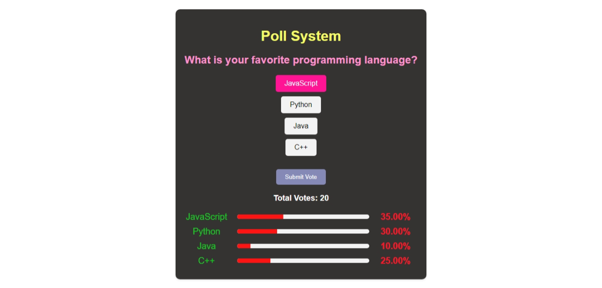

Here’s a `README.md` file for the Poll System project:

# Poll System

A dynamic poll system built using **HTML**, **CSS**, and **JavaScript**. This application allows users to vote on a specific topic and view real-time poll results.



## Features

- **Interactive Polling**: 
  - Users can select their choice and submit their vote.
  - Real-time vote percentage updates.
- **Dynamic Bar Chart**: Visual representation of poll results using progress bars.
- **Responsive Design**: Optimized for different screen sizes.
- **Persistent Data**: Retains vote counts during the session.

## Installation

1. Clone the repository:
   ```bash
   git clone https://github.com/muaz64/Pollsystem.git
   ```
2. Navigate to the project directory:
   ```bash
   cd Pollsystem
   ```

## Usage

1. Open the `index.html` file in any modern browser.
2. Select your preferred option from the list.
3. Click **Submit Vote** to cast your vote.
4. The results will be updated immediately, showing:
   - Total votes.
   - Vote percentages for each option.

## File Structure

```
Pollsystem/
├── index.html     # Main HTML file
├── style.css      # CSS for styling the UI
├── script.js      # JavaScript for poll logic
├── README.md      # Documentation
```

## How It Works

1. **HTML**: Provides the structure for the poll system.
2. **CSS**: Styles the poll system to make it visually appealing.
3. **JavaScript**:
   - Handles user interactions and vote submission.
   - Dynamically updates the total votes and percentage bars.

### Example Poll Question

**What is your favorite programming language?**
- **Options**:
  - JavaScript
  - Python
  - Java
  - C++

Results are dynamically displayed with a bar chart and percentages.

### Sample Result
```
JavaScript: 35.00%
Python: 30.00%
Java: 10.00%
C++: 25.00%
Total Votes: 20
```

## Compatibility

This project works seamlessly on all modern browsers, including:
- Google Chrome
- Mozilla Firefox
- Microsoft Edge
- Safari

## License

This project is licensed under the **MIT License**. Feel free to use, modify, and distribute it.

## Contributions

Contributions are welcome! To contribute:
1. Fork the repository.
2. Create a new branch with your feature or bugfix.
3. Submit a pull request with detailed changes.

---